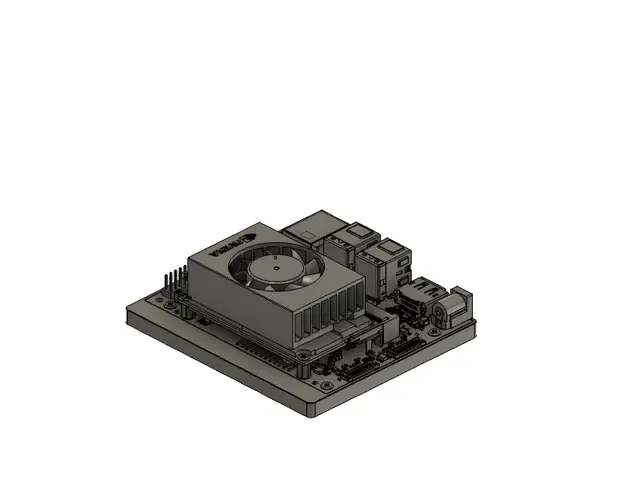
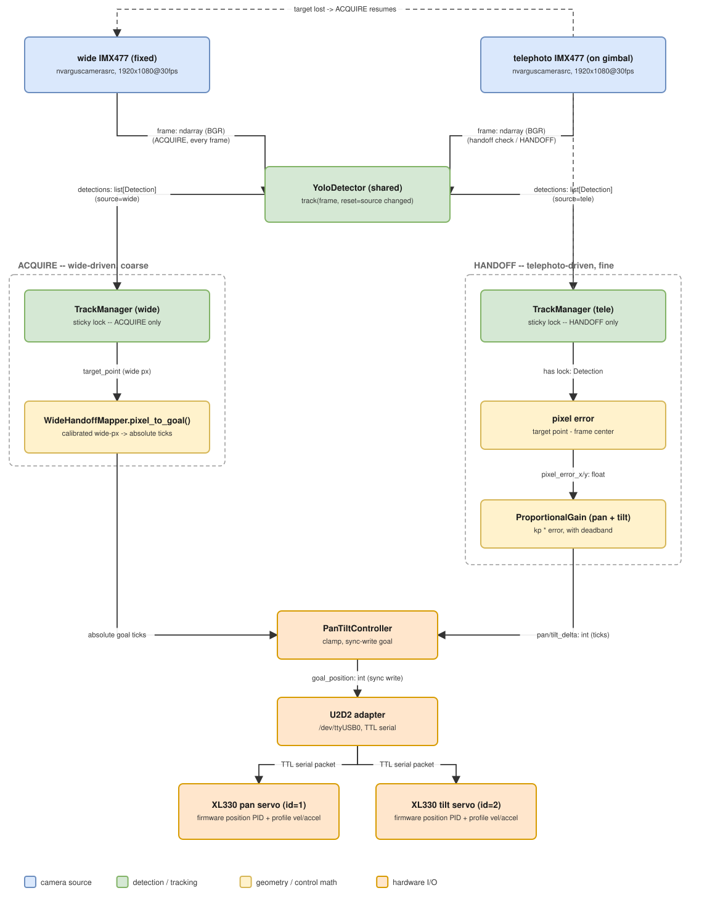

# pan-tilt-track

A prototype multi-camera target tracking platform with pan/tilt control. A fixed position wide-angle
camera acquires a target (or multiple candidates), then a telephoto camera on a pan/tilt bracket 
tracks it. An initial calibration step loosely maps the wide-angle camera's pixel coordinates to 
pan/tilt servo positions, enabling target handoff to the telephoto camera. 

Intended features not yet implemented: 
1. Target ID/ReID. 

## Enclosure Design

Most parts are 3D printed, with the exception of **`DYNAMIXEL H101`** and **`S102`** servo brackets
and various assembly hardware (M2 and M3 screws, nuts, spacers, heat-set inserts, etc.). The model 
files can be found in `assets/`. Construction details are not included in this repository, but the 
short video below shows the basic assembly and mechanical operation. 

<p align="center">
  
</p>

## Electronics & Hardware

### Compute

Jetson Orin Nano Super Developer Kit. `L4T 36.5.0` / `JetPack 6.2`. `MAXN` power mode. 

### Cameras
This project was validated with (2x) **`Arducam IMX477`** CSI sensors. Other 
Jetson-compatible cameras may also work, but it is important to check with the manufacturer if the
camera modules can be used in a dual-CSI configuration. The Arducam IMX477 MINI does provide dual-CSI
support for Jetson Orin, and the platform allows for lenses to be swapped so that one sensor can be
equipped for wide-angle target acquisition (see more) and the other for telephoto (see "better"). 

| Lens | Mount | Role in tracking
| --- | --- | --- |
| **wide** | Fixed/stationary | Decides where to swing the gimbal to *acquire* a target. |
| **telephoto** | Pan/Tilt | Tracks targets (via PID control loop) once acquired. Higher pixels-on-target. 

Relevant specs are defined in `config/cameras.json` (used for `gstreamer` pipelines and calibration).

#### Calibration

A run-once calibration `scripts/calibrate_wide_handoff.py` produces `config/wide_handoff.json`, which
maps a detected pixel location in the wide camera's fixed frame to an absolute pan/tilt
"goal" position. 

Wide and telephoto are non-collocated cameras (different optical centers), so a detection in wide's 
view corresponds to a "line" of possible positions in 3D space (the ray through that pixel). 
Additional information, such as a target's depth, is needed to find the *precise* point on 
that line telephoto needs to be aimed at. Camera calibration alone doesn't solve this, but unlike 
many vision tasks that require precise correspondence (e.g. traditional stereo matching), this system just 
needs to put a target somewhere in the telephoto camera's FOV. If the calibration is performed at or 
near the "expected" target distance, the mapping of pixel-to-pan/tilt angle is more than accurate 
enough. 

Notably, this calibration can be run in-situ without any special calibration 
target. It uses a keypoint regression to find correspondeces between the two cameras' views. 

### Servos

2x **`ROBOTIS DYNAMIXEL XL330`** w/ **`ROBOTIS U2D2`** USB-to-TTL adapter (assumed to be on 
`/dev/ttyUSB0`).


| Joint | ID | Range |
| --- | --- | --- |
| Pan | 1 | ≈269° |
| Tilt | 2 | ≈105°, one-sided from mechanical center |

Port/baudrate/IDs/joint limits are in`config/servos.json` (also see 
`pan_tilt_track/dynamixel/config.py`).

#### Position PID / profile tuning

A PID profile is written to the servo's RAM control table by `PanTiltController.initialize()` on 
**every startup**.

| Joint | profile_velocity | profile_acceleration | position_p_gain | position_i_gain |
| --- | --- | --- | --- | --- |
| Pan | 200 | 30 | 400 (default) | 30 |
| Tilt | 200 | 30 | 800 | 60 |

Note: If other servos or cameras are used, the above values may need to be re-tuned. The 
`scripts/init_servos.py` script can be used to write new values to the servos' RAM.

## Program Flow

Two-stage tracking where a wide FOV camera acquires targets and hands them off to a telephoto 
camera mounted on a pan/tile mechanism.

<p align="center">
  
</p>

<sub>Source: `assets/block_diagram.mmd`. Regenerate after editing with `mermaid.ink` or `mmdc`.</sub>

## Architecture

```
pan_tilt_track/
├── dynamixel/  servo control (dynamixel_sdk wrapper): torque enable,
│               EEPROM/RAM writes, sync-write goal positions; Config 
│               (port, IDs, joint limits) loads from config/servos.json.
├── tracking/   YOLO26 track() wrapper (ByteTrack) + target.py's
│               select_target() policy + TrackManager. Wide
│               and telephoto each run independent instances.
├── control/    telephoto's tracking control loop (loop.py's TrackingLoop):
│               gain.py's ProportionalGain + gains.py's tuned
│               configuration. wide_handoff.py: the coarse
│               stage's WideHandoffMapper + config/wide_handoff.json
│               loader/writer.
├── camera/     nvarguscamerasrc capture (gstreamer_source.py) + 
│               config (config.py) for both IMX477s.
└── stream/     Picture-in-Picture (PIP) compositing (pip_compositor.py), 
                the RTSP-relay wrapper (pip_relay.py), and the RTSP server
                (rtsp_stream.py) for remote viewing.
```

`TrackManager`'s independent per-camera instances are never ID-correlated
across cameras. To be addressed in future work (ID/ReID). 
`--target-mode {body,head}` selects bbox center or head-keypoint centroid
for both cameras uniformly. `kp` sign is mount-specific, verified via
`scripts/sign_check.py`: pan `kp < 0`, tilt `kp > 0` on this head;
re-run after any reassembly or camera reorientation.

## Setup: Docker (recommended)

The ML stack (torch/CUDA/OpenCV) is built into an image rather than a
bare venv. See `Dockerfile` for the pinned versions and why.

```bash
docker build -t pan-tilt-track .
./scripts/docker-run.sh                        # runs the full tracker
./scripts/docker-run.sh python scripts/init_servos.py
./scripts/docker-run.sh python scripts/dual_camera_smoke_test.py
```

`docker-run.sh` passes `--runtime nvidia` for GPU, `-v /dev:/dev` +
the Argus socket for the cameras, and `--device /dev/ttyUSB0` for the
servos. GPU YOLO, dual-camera capture, and servo serial are all
confirmed working from inside the container.

Base image: `nvcr.io/nvidia/l4t-jetpack:r36.4.0`.

## Setup: bare host venv (alternative)

```bash
python3 -m venv --system-site-packages .venv
source .venv/bin/activate
pip install -e ".[dev]"
```

`--system-site-packages` picks up the GStreamer-enabled system OpenCV.
`ultralytics` pulls in `opencv-python` transitively and can shadow it:
check with `python -c "import cv2; print(cv2.__file__)"` (should resolve
to `/usr/lib/python3.10/dist-packages`) and `pip uninstall -y
opencv-python` if not. `numpy<2` is pinned for the same reason.

YOLO runs CPU-only here unless you separately install a Jetson-native
PyTorch build. See `Dockerfile`.

## One-time host setup

```bash
./scripts/setup_ftdi_latency.sh
```

Fixes the U2D2's FTDI latency timer (16ms default, caps round-trip rate
near 60Hz regardless of baud).

## Usage

```bash
# Bring up the servos. Profile Velocity/Acceleration are RAM and reset
# every power-cycle: run this after every reboot.
python scripts/init_servos.py

# Confirm each camera pipeline individually, or both concurrently.
python scripts/camera_smoke_test.py --role telephoto
python scripts/camera_smoke_test.py --role wide
python scripts/dual_camera_smoke_test.py

# One-time (or after any reassembly/remount): calibrate the wide-camera
# handoff mapping. Walk around, visible to both cameras for at least
# part of the session, until it collects enough samples (Ctrl+C to stop
# early, or wait for --min-samples). Writes config/wide_handoff.json,
# which run_tracker.py refuses to start without.
#
# Walk at (or around) the distance from the rig you actually expect
# targets to be tracked at -- see Architecture above: the fit is only
# accurate near whatever depth the calibration samples were collected
# at, so calibrating at the wrong distance biases every later handoff.
python scripts/calibrate_wide_handoff.py

# Full two-stage tracking loop: wide acquires, telephoto fine-tracks.
# --rtsp serves the raw (telephoto) feed at rtsp://<jetson-ip>:8554/pan-tilt.
python scripts/run_tracker.py --rtsp

# Same, with the wide camera composited in as a picture-in-picture inset.
python scripts/run_tracker.py --rtsp --rtsp-pip

# Track the head instead of the body (both cameras).
python scripts/run_tracker.py --target-mode head --rtsp

# Point at a different rig's config (defaults are config/cameras.json,
# config/servos.json, and config/wide_handoff.json).
python scripts/run_tracker.py --camera-config path/to/cameras.json --servo-config path/to/servos.json --wide-handoff-config path/to/wide_handoff.json
```

Prefix any command with `./scripts/docker-run.sh` to run in the
container.

Other scripts:

- `scripts/sign_check.py`: empirically verifies the pan/tilt `kp` sign
  convention against real hardware (telephoto's own fine-tracking loop);
  run after any reassembly.
- `scripts/read_servo_config.py`: reads current EEPROM/RAM state off
  both servos at any time (read-only, safe with torque on or off).
- `scripts/rtsp_server.py` / `scripts/dual_camera_rtsp_pip.py`:
  camera-only RTSP viewers (single feed, or wide+telephoto PIP) with no
  servo/detection dependency, for checking framing/focus cheaply.

## Tests

```bash
pytest
```

`test_gain.py`, `test_target.py`, `test_track_manager.py`, and
`test_overlay.py` are pure-logic, no hardware required. Everything else
talks to real servos and/or real cameras and is verified by running the
scripts above.
