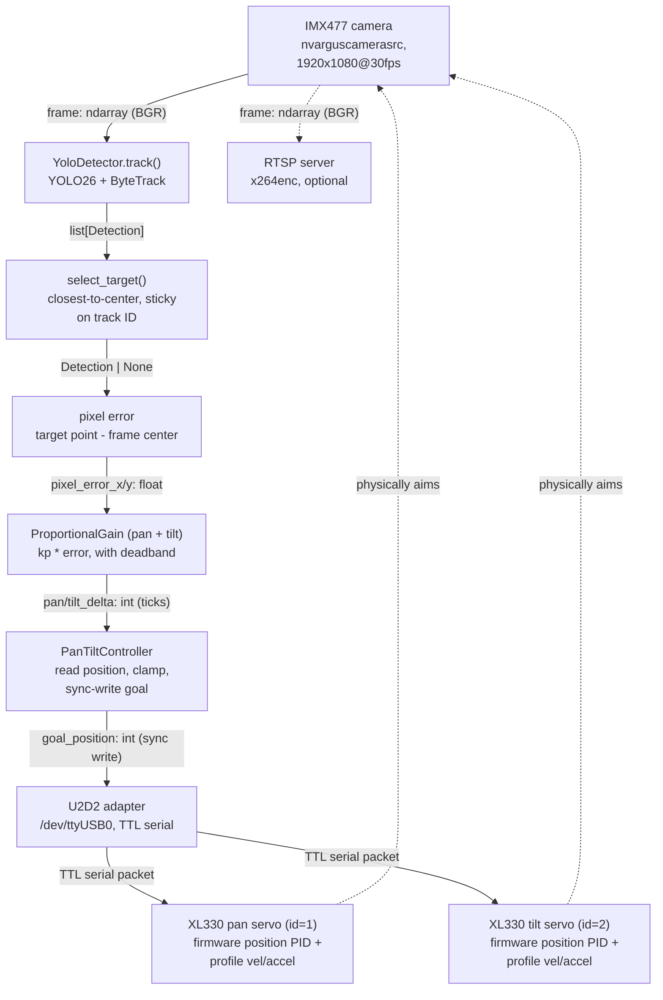

# pan-tilt-track

Two-DOF (pan/tilt) visual tracking head: DYNAMIXEL XL330 servo control +
YOLO26 detection/tracking, closing the loop from pixel error to servo
motion.

Standalone Python package, built to be pulled in as a submodule of a
larger system (wide-angle camera, global tracking, identification).

## Hardware

- **Compute**: Jetson Orin Nano Super Developer Kit
  - L4T 36.5.0 / JetPack 6.2
  - No hardware video encoder — optional RTSP feed uses software
    encoding (`x264enc`), competes with YOLO for CPU
- **Camera**: IMX477 CSI sensor
  - `nvarguscamerasrc`, 1920x1080@30fps
- **Servos**: 2x ROBOTIS DYNAMIXEL XL330, Protocol 2.0
  - Pan = ID 1, 490–3550 ticks (≈269°)
  - Tilt = ID 2, 2048–3246 ticks (≈105°, one-sided from mechanical center)
  - 57600 baud, driven directly — no external servo controller board
- **Servo interface**: ROBOTIS U2D2 USB-to-TTL adapter
  - `/dev/ttyUSB0`
- **Mechanical**: 2-DOF pan/tilt bracket
  - Actuated directly by the two XL330s

## Block diagram



The servo firmware's position PID + Profile Velocity/Acceleration is the
only closed-loop control at the joint level. The bracket physically
re-aiming the camera is what closes the loop back to vision — this
codebase never reads back whether a goal position was actually reached.

## Architecture

- `dynamixel/` — servo control (`dynamixel_sdk` wrapper): torque enable,
  EEPROM/RAM writes, sync-write goal positions. No control law of its own.
- `tracking/` — YOLO26 `track()` wrapper, pinned to ByteTrack
  (`tracker="bytetrack.yaml"`), plus target selection (closest-to-center,
  sticky on track ID). `--target-mode {body,head}` selects bbox center or
  head-keypoint centroid (head falls back to body center per-frame when
  keypoints aren't visible).
- `control/` — outer (vision) loop: proportional gain + deadband, pixel
  error to goal-position delta. Deliberately not a full PID — see
  `control/gain.py`. `kp` sign is mount-specific, verified via
  `scripts/sign_check.py`: pan `kp < 0`, tilt `kp > 0` on this head.
  Re-run after any reassembly or camera reorientation.
- `camera/` — `nvarguscamerasrc` capture for the IMX477, plus an
  independent RTSP server (`camera/rtsp_stream.py`) for remote viewing.

## Setup: Docker (recommended)

The ML stack (torch/CUDA/OpenCV) is built into an image rather than a
bare venv — see `Dockerfile` for the pinned versions and why.

```bash
docker build -t pan-tilt-track .
./scripts/docker-run.sh                        # runs the full tracker
./scripts/docker-run.sh python scripts/init_servos.py
./scripts/docker-run.sh python scripts/camera_smoke_test.py
```

`docker-run.sh` passes `--runtime nvidia` for GPU, `-v /dev:/dev` +
the Argus socket for the camera, and `--device /dev/ttyUSB0` for the
servos. GPU YOLO, camera capture, and servo serial are all confirmed
working from inside the container.

Base image: `nvcr.io/nvidia/l4t-jetpack:r36.4.0`.

## Setup: bare host venv (alternative)

```bash
python3 -m venv --system-site-packages .venv
source .venv/bin/activate
pip install -e ".[dev]"
```

`--system-site-packages` picks up the GStreamer-enabled system OpenCV.
`ultralytics` pulls in `opencv-python` transitively and can shadow it —
check with `python -c "import cv2; print(cv2.__file__)"` (should resolve
to `/usr/lib/python3.10/dist-packages`) and `pip uninstall -y
opencv-python` if not. `numpy<2` is pinned for the same reason.

YOLO runs CPU-only here unless you separately install a Jetson-native
PyTorch build — see `Dockerfile`.

## One-time host setup

```bash
./scripts/setup_ftdi_latency.sh
```

Fixes the U2D2's FTDI latency timer (16ms default, caps round-trip rate
near 60Hz regardless of baud).

## Usage

```bash
# Bring up the servos. Profile Velocity/Acceleration are RAM and reset
# every power-cycle — run this after every reboot.
python scripts/init_servos.py

# Confirm the camera pipeline.
python scripts/camera_smoke_test.py

# Full tracking loop. --rtsp serves the raw feed at
# rtsp://<jetson-ip>:8554/pan-tilt.
python scripts/run_tracker.py --rtsp

# Track the head instead of the body.
python scripts/run_tracker.py --target-mode head --rtsp
```

Prefix any command with `./scripts/docker-run.sh` to run in the
container.

`scripts/read_servo_config.py` reads current EEPROM/RAM state off both
servos at any time (read-only, safe with torque on or off).

## Tests

```bash
pytest
```

`test_gain.py`, `test_target.py`, and `test_overlay.py` are pure-logic,
no hardware required. Everything else talks to real servos and/or the
real camera and is verified by running the scripts above.
